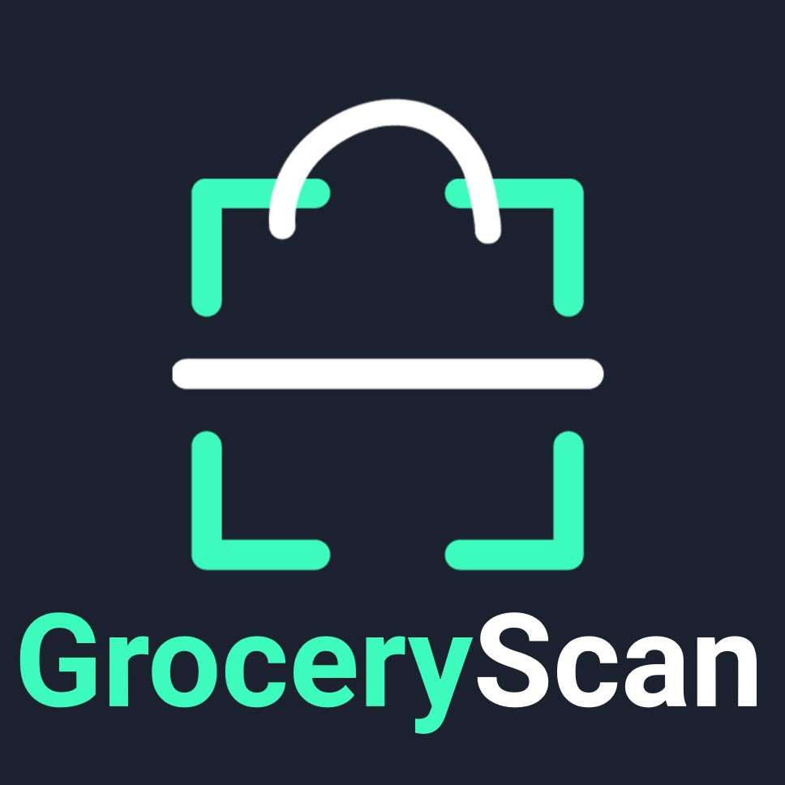

# Grocery App

This repository contains the source code for the Grocery App, a BusinessDevLab startup idea. The app is developed using Flutter and is designed to provide users with a seamless grocery shopping experience.



## Getting Started

This project is a starting point for a Flutter application. To get started with Flutter development, you will need to set up your development environment.


### Prerequisites

- Flutter SDK: [Install Flutter](https://flutter.dev/docs/get-started/install)
- Dart SDK: Included with Flutter
- IDE: [Android Studio](https://developer.android.com/studio) or [Visual Studio Code](https://code.visualstudio.com/)

### Installation

1. Clone the repository:
    ```sh
   git clone https://github.com/Bence749/grocery_app.git
   ```
2. Navigate to the project directory:
    ```sh
    cd grocery_app
    ```
   
3. Install the dependencies:
    ```sh
   flutter pub get
   ```


### Running the App

1. Connect your device or start an emulator.
2. Run the app:
    ```sh
    flutter run
   ```


## Project Structure

The project is organized as follows:

- `android`: Android-specific files.
- `assets`: Assets such as images and fonts.
- `ios`: iOS-specific files.
- `lib`: Main Flutter application code.
- `web`: Web-specific files.
- `windows`: Windows-specific files.

## Detailed Description

The Grocery App is a comprehensive solution for managing grocery shopping. It features a user-friendly interface for browsing and adding items to the shopping list, scanning barcodes for quick entry, and tracking purchases. The app connects to a backend server to manage and synchronize data.

### Backend Integration

The backend for the application is provided by the [Grocery App Server](https://github.com/adamdienes/grocery_app_server). This Node.js server manages the application's data, using SQLite for database storage and offering various API endpoints for CRUD operations.


#### Key Features

- **Barcode Scanning:** Quickly add items to your list by scanning barcodes.
- **Real-time Synchronization:** Keep your data synchronized across multiple devices.
- **Product Management:** Add, update, and delete grocery items with ease.
- **Ingredient List:** View detailed information about each product, including ingredients.

### Running the Server

1. Clone the backend repository:
    ```sh
    git clone https://github.com/adamdienes/grocery_app_server.git
    ```

2. Navigate to the project directory:
    ```sh
    cd grocery_app_server
    ```
   
3. Install the dependencies:
    ```sh
    npm install
    ```
   
4. Start the server:
    ```sh
    node ./server.js
    ```


## Contributing

Contributions are welcome! Please fork the repository and create a pull request to contribute.

### Steps to Contribute

1. Fork the repository.
2. Create a new branch (`git checkout -b feature/your-feature`).
3. Commit your changes (`git commit -m 'Add some feature'`).
4. Push to the branch (`git push origin feature/your-feature`).
5. Create a pull request.

## Contact

For any inquiries, please contact directly on github.

## Acknowledgements

- [Flutter](https://flutter.dev/)
- [Dart](https://dart.dev/)
- [Node.js](https://nodejs.org/)
- [Express.js](https://expressjs.com/)

